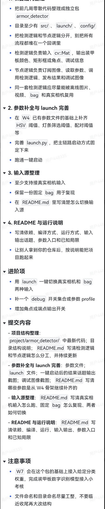

# Week 5 - armor_detector 包整理与整改说明

## 1. 任务要求

本周任务要求截图：



核心要求包括：

- 整理独立 `armor_detector` 包，包含 `src/`、`launch/`、`config/`
- 检测逻辑与 ROS 节点逻辑分离
- 检测逻辑输入 `cv::Mat`，输出装甲板颜色、框/角点和调试信息
- ROS 节点负责订阅图像、读取参数、调用检测逻辑、发布结果和调试图像
- 参数文件包含 HSV 阈值、灯条筛选阈值等
- 完善 launch，一键启动主链路
- 支持真实相机、bag、离线视频等输入方式
- README 写清楚依赖、编译、运行、话题、参数和已知问题

## 2. 完成情况

| 要求 | 完成情况 | 对应文件 |
| --- | --- | --- |
| 独立包结构 | 已完成 | `src/armor_detector/` |
| `src/ launch/ config/` | 已完成 | `src/armor_detector/src/`、`launch/`、`config/` |
| 检测逻辑与 ROS 节点分离 | 已完成 | `include/armor_detector/armor_detect_core.hpp`、`src/detector_node.cpp` |
| 检测逻辑输入 `cv::Mat` | 已完成 | `armor_detect::Detector::detect()` |
| 输出颜色和四点 | 已完成 | `/armor_result` JSON 风格字符串 |
| 发布调试图像 | 已完成 | `/armor/debug_image` |
| 参数文件 | 已完成 | `config/params.yaml` |
| launch 一键启动 | 已完成 | `launch/detector.launch.py` |
| 安装 launch/config | 已完成 | `CMakeLists.txt` |
| README | 已完成 | `README.md` |

## 3. 当前检测链路

```text
HSV mask -> findContours -> boundingRect 面积过滤 -> 长宽比过滤 -> TOP2 排序 -> 装甲板四点
```

## 4. 关键输出

`/armor_result` 输出格式：

```json
{"detected":true,"armors":[{"color":"red","points":[[258,180],[368,180],[368,300],[258,300]]}]}
```

未检测到时：

```json
{"detected":false,"armors":[]}
```

四点顺序：

```text
左上、右上、右下、左下
```

## 5. 验证记录

已完成本地验证：

```text
colcon build 通过
install/share 下存在 launch 和 config
synthetic 双灯条测试中 /armor_result 能输出 color + points
```

## 6. 还建议补充的截图

如果需要更完整的作业证明，建议补：

- `build_success.png`：编译成功截图
- `launch_success.png`：`ros2 launch armor_detector detector.launch.py` 启动截图
- `armor_result_topic.png`：`ros2 topic echo /armor_result` 输出截图
- `debug_image_result.png`：`/armor/debug_image` 检测框截图
- `readme_github.png`：GitHub README 页面截图

这些截图不是代码整改必需，但能让提交材料更完整。
